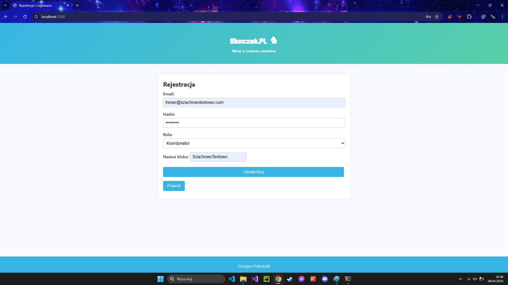
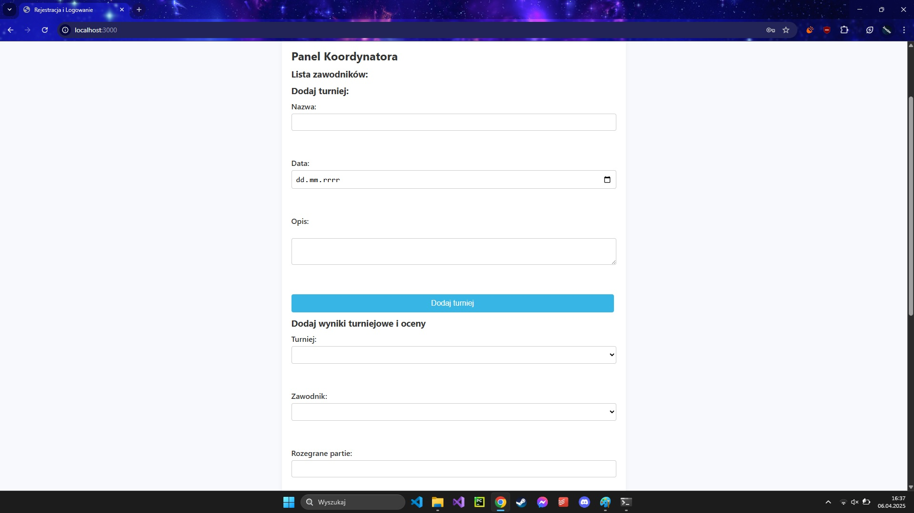
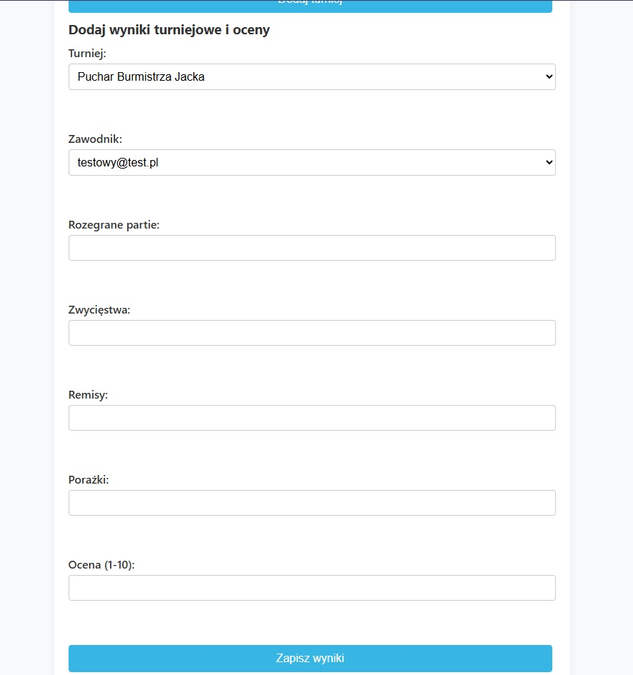
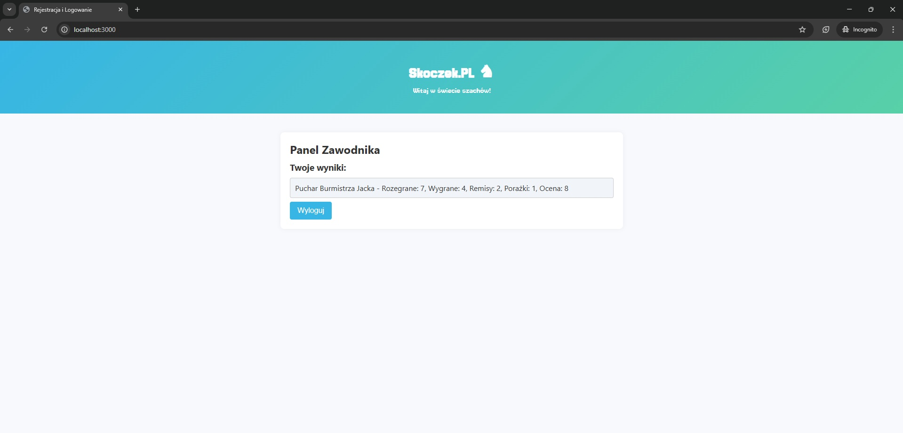

Simple university project
"1. Zakładanie konta odbywa się przez formularz (wspólny dla koordynatora klubu i zawodnika klubu –
wybór roli w ramach formularza). Wymagane dane to login, hasło oraz wybór opcji: koordynatora lub
zawodnika/szachisty. Zakładamy uproszczony schemat: podczas rejestracji koordynatora tworzony
jest nowy klub szachowy o unikalnej nazwie, której już nie można zmienić. Nazwa ta może być
podana przez użytkownika (preferowane) lub być generowana automatycznie. Koordynator nie może
zmienić klubu.
2. Login może mieć tylko i wyłącznie postać poprawnego adresu mailowego (żadnych maili system
jednak nie musi wysyłać).
3. Po pierwszym zalogowaniu zawodnik/szachista może zapisać się do klubu. Zakładamy wybór
pojedynczego klubu (spośród dostępnych koordynatorów).
4. Koordynator może dodawać turnieje treningowe (wymagany jest opis, data i godzina turnieju
treningowego), po których wpisuje wyniki uzyskane przez graczy przez niego prowadzonych (co
najmniej liczba rozegranych partii, liczba zwycięstw, remisów i porażek - nie ma wymogu
zapewnienia/sprawdzania spójności wyników w ramach turnieju, niemniej taka funkcjonalność jest
mile widziana).
5. Koordynator, obok wyników, może wystawiać oceny za turniej dla każdego zawodnika, którego
prowadzi. Możliwe oceny to liczby od 1 (najsłabsza), do 10 (najwyższa).
6. Szachista może przeglądać tylko własne wyniki i oceny
● Dane muszą być przechowywane w bazie danych (może być NoSQL).
● Wszystkie dane wprowadzane przez użytkownika muszą być weryfikowane zarówno po stronie
przeglądarki użytkownika, jak i po stronie serwera.
● Hasła użytkowników nie mogą być przechowywane w postaci otwartego tekstu.
● Nie wolno wykorzystywać gotowych frameworków typu CMS."

